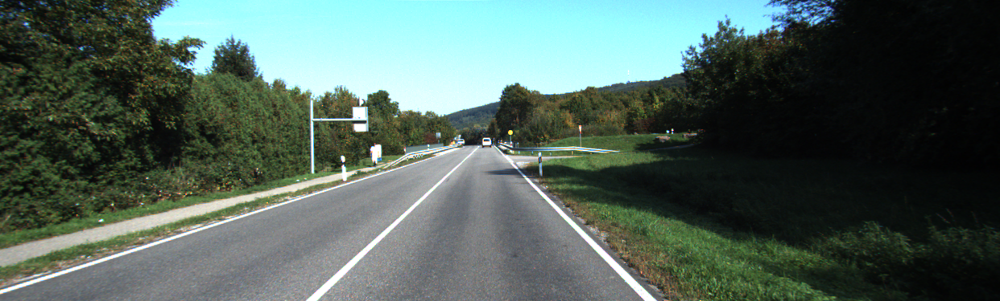
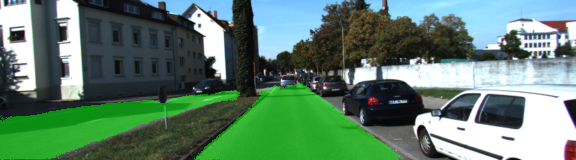

# Assigment-FCN-The-KITTI-Vision
This is a naive FCN to segment the roads in KITTI data set

Steps to run the code 

1.Network uses VGG-16 weights, first, download VGG-16 pre-trained weights from https://www.cs.toronto.edu/~frossard/vgg16/vgg16_weights.npz and save in the the data/vgg  folder.

2.Download KITTI dataset and save it in the data/data_road folder.(http://www.cvlibs.net/download.php?file=data_road.zip)

3. Run main.py with Python 3

Requirements 

Create folders by follwoing names before running 

1. data
2.runs

Use a tensorflow version higher than 1.1

After you run the code there will be segmented images inside runs folder

Results Visualization

Example Data 

Hand Labeled Masks 

1. Outputs of the FCN

2. Outputs of the FCN

